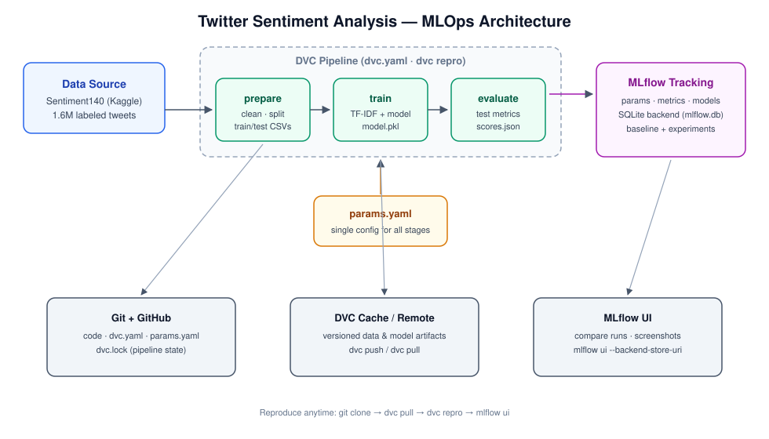

# Twitter Sentiment Analysis — MLOps Pipeline

MAI201 Machine Learning Operations · Seneca Polytechnic
Team: Debolina Das (ML Lead) · Monireh Eshghinezhad (Engineering Lead) · Anish Dasgupta (Project Lead)

A reproducible sentiment-classification pipeline for the Sentiment140 Twitter dataset, built with **DVC** (3-stage pipeline + data/model versioning) and **MLflow** (experiment tracking).



## 1. Dataset Documentation

| Attribute | Details |
|---|---|
| **Name** | Sentiment140 |
| **Source** | Kaggle — https://www.kaggle.com/datasets/kazanova/sentiment140 |
| **Size** | 1,600,000 tweets (~238 MB CSV, latin-1 encoded, no header row) |
| **Features (6 columns)** | `target` (sentiment label), `id` (tweet ID), `date`, `flag` (query), `user`, `text` |
| **Labels** | `0` = negative, `4` = positive (the released dataset contains **no neutral tweets**, so this is a binary task) |
| **Class balance** | Exactly 800K negative / 800K positive — balanced by construction |
| **Time period** | 2009–2010, English |
| **Labeling method** | Distant supervision: emoticons in the tweet were used as noisy labels, then removed from the text |

**Data quality notes** (found during EDA, handled in the `prepare` stage):
- Tweets contain URLs, @mentions, and #hashtags → stripped/normalized during cleaning.
- Noisy labels (emoticon-based), so a few percent label error is expected — an accuracy ceiling well below 100%.
- Informal language, slang, misspellings → TF-IDF with sub-word-free tokens still performs well as a baseline.
- The `flag`, `user`, `id`, and `date` columns carry no sentiment signal and are dropped.

## 2. Repository Structure

```
├── dvc.yaml            # 3-stage DVC pipeline: prepare → train → evaluate
├── params.yaml         # single config file driving all stages + experiments
├── requirements.txt
├── src/
│   ├── prepare.py      # clean text, stratified train/test split
│   ├── train.py        # vectorize + fit model, log run to MLflow
│   └── evaluate.py     # test metrics → metrics/scores.json + same MLflow run
├── docs/
│   └── architecture.svg
├── data/               # raw + processed data (DVC-managed, git-ignored)
├── models/             # trained model.pkl (git-ignored)
└── metrics/            # scores.json, confusion_matrix.json
```

## 3. Setup

```bash
git clone <your-repo-url> && cd twitter-sentiment-mlops
python -m venv .venv && source .venv/bin/activate   # Windows: .venv\Scripts\activate
pip install -r requirements.txt
```

Download Sentiment140 from Kaggle and place the CSV at:

```
data/raw/sentiment140.csv
```

(Optional) track the raw data with DVC and push it to a remote:

```bash
dvc add data/raw/sentiment140.csv
dvc remote add -d storage <s3://bucket | gdrive://folder-id | /path/to/dir>
dvc push
```

## 4. Run the Pipeline

```bash
dvc repro          # runs prepare → train → evaluate (only stale stages re-run)
dvc metrics show   # view test metrics tracked by DVC
dvc dag            # visualize the stage graph
```

`params.yaml` starts with `sample_size: 100000` for fast iteration on a laptop.
Set `sample_size: null` to train on the full 1.6M tweets for final results.

## 5. Experiments with MLflow

Every `dvc repro` that re-runs `train` creates one MLflow run (params + train/test metrics + model artifact) in a local SQLite backend (`mlflow.db`).

**Baseline + 2 experiments** — edit `params.yaml` between runs:

| Run | Change in `params.yaml` |
|---|---|
| **Baseline** | `model: logreg`, `vectorizer: tfidf`, `ngram_max: 1` (as committed) |
| **Experiment 1** | `featurize.ngram_max: 2` (add bigrams) |
| **Experiment 2** | `train.model: nb` (Naive Bayes) — or `linearsvc`, or change `C` |

After each edit, run `dvc repro` (DVC skips `prepare` since data didn't change).

**View & screenshot runs:**

```bash
mlflow ui --backend-store-uri sqlite:///mlflow.db
# open http://127.0.0.1:5000, select the "twitter-sentiment-analysis" experiment,
# tick all runs → Compare → screenshot the params/metrics comparison table
```

Screenshots to capture for the deliverable:
1. Experiment page listing all runs (baseline + 2 experiments)
2. Run-comparison view showing params vs. `test_accuracy` / `test_f1`
3. A single run's page showing logged params, metrics, and the model artifact

## 6. Success Metrics (from proposal)

- Test accuracy ≥ 80%, precision/recall/F1 ≥ 0.73 per class, AUC-ROC ≥ 0.80
- Fully reproducible pipeline: `git clone → dvc pull → dvc repro`

A TF-IDF + Logistic Regression baseline on the full dataset typically lands around 79–82% accuracy on Sentiment140, so the baseline alone should approach the target, with n-grams/model experiments closing the gap.
